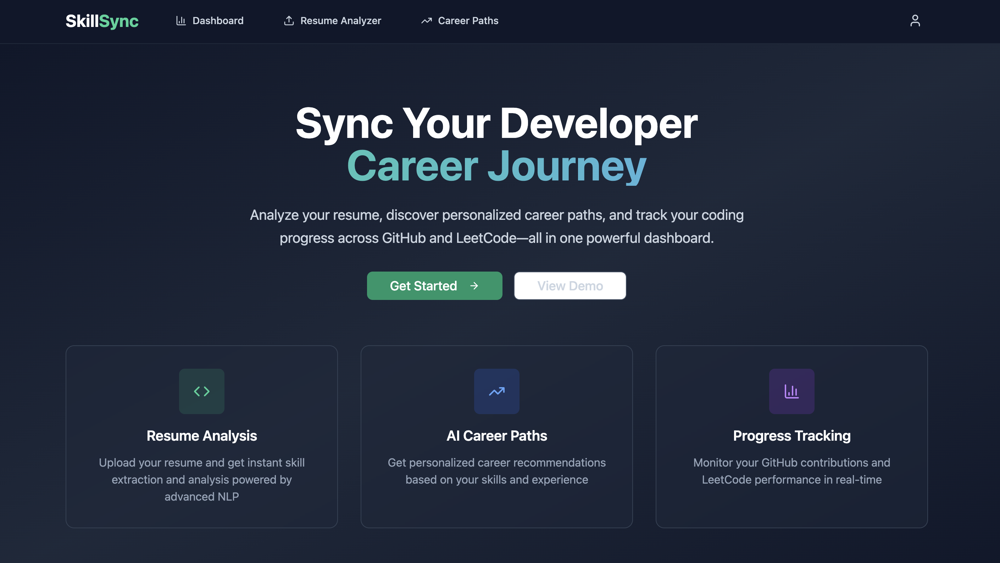

# SkillSync - Developer Career Tool



A lightweight career tool for developers that analyzes resumes, tracks progress from GitHub and LeetCode, and provides AI-powered career path suggestions.

## Features

### Core Features
- **Resume Analyzer**: Upload PDF resumes and extract skills, experience, and education using NLP
- **Career Path Suggestions**: AI-powered recommendations based on skills and experience
- **Progress Dashboard**: Track GitHub and LeetCode statistics with visual charts
- **GitHub Integration**: OAuth authentication and repository data fetching
- **LeetCode Integration**: Problem-solving statistics and contest performance

### Tech Stack
- **Frontend**: React + TypeScript + TailwindCSS + Recharts
- **Express Backend**: Node.js + Express (OAuth, dashboard data, API routes)
- **FastAPI Backend**: Python + FastAPI (resume analysis, AI integration)
- **Database**: PostgreSQL
- **Deployment**: Docker + Railway/Render (backend) + Vercel (frontend)

## Project Structure

```
skillsync/
├── src/                    # Frontend React app
│   ├── components/        # UI components
│   │   ├── components/        # UI components
│   │   ├── pages/            # Page components
│   │   └── hooks/            # Custom hooks
│   ├── backend/
│   │   ├── express/          # Node.js + Express backend
│   │   │   ├── src/
│   │   │   │   ├── routes/   # API routes
│   │   │   │   ├── services/ # Business logic
│   │   │   │   └── config/   # Configuration
│   │   │   └── package.json
│   │   └── fastapi/          # Python + FastAPI backend
│   │       ├── app/
│   │       │   ├── routers/  # API endpoints
│   │       │   ├── services/ # Business logic
│   │       │   └── models/   # Pydantic models
│   │       └── requirements.txt
│   ├── db/
│   │   └── schema.sql        # PostgreSQL schema
│   └── docker-compose.yml    # Docker orchestration
└── README.md
```

## Roadmap

- [ ] Real-time notifications
- [ ] Advanced analytics dashboard
- [ ] Integration with more platforms (LinkedIn, Stack Overflow)
- [ ] Mobile app development
- [ ] Advanced AI career recommendations
- [ ] Resume template generator
- [ ] Interview preparation tools
